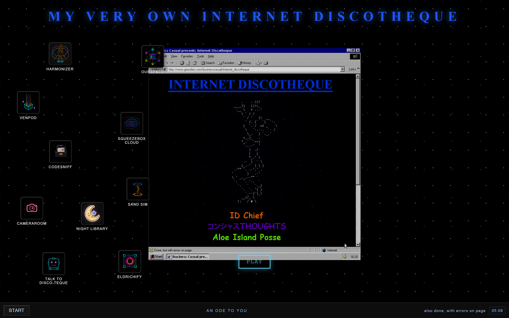
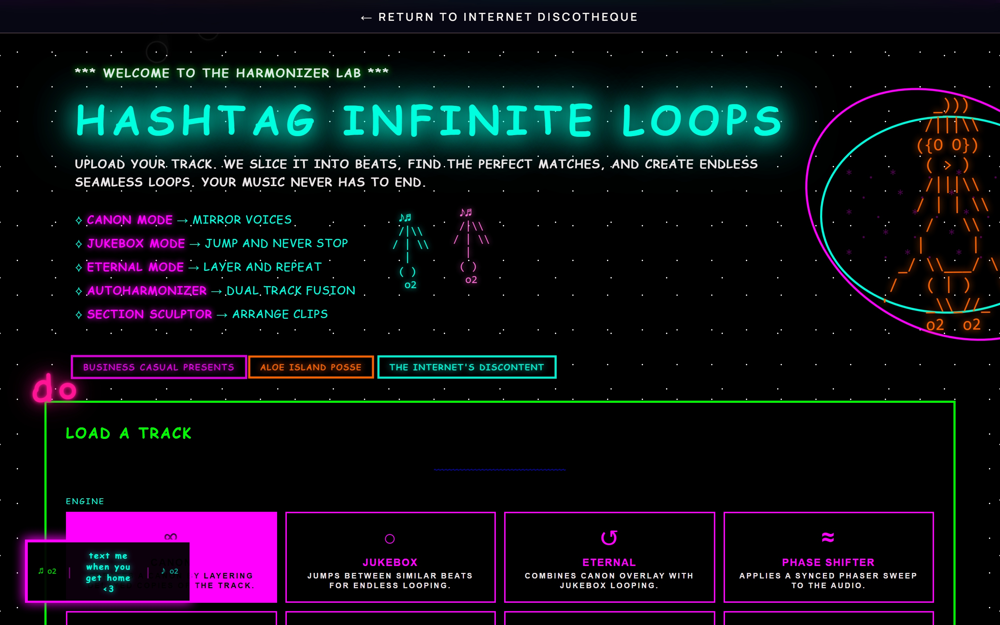
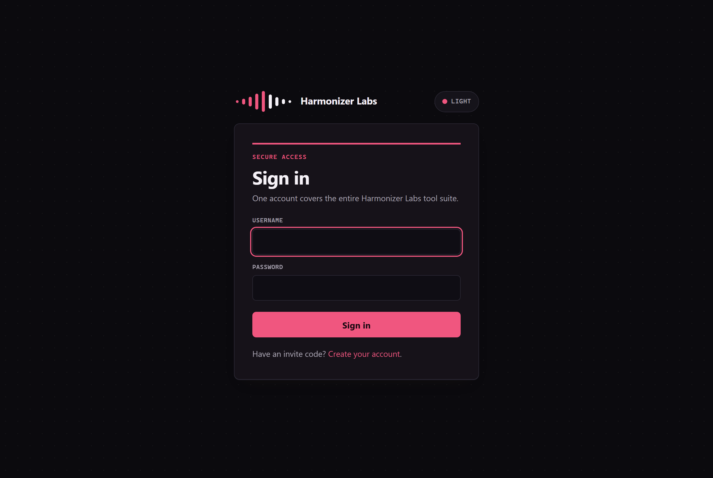

# Harmonizer — a self-hosted creative browser lab

**A retro "desktop of the web" that boots a whole shelf of from-scratch tools — a
beat-sliced audio re-looping engine, semantic code search, image transforms, a
profile builder, a voxel sandbox — each its own app, all behind one single sign-on
and served live from a VPS.**



*The live landing at **[harmonizerlabs.cc](https://harmonizerlabs.cc)** — a from-scratch draggable desktop environment, built in the browser, that launches every tool below.*

| Beat-sliced audio re-looping | One login for every tool |
|---|---|
|  |  |
| **Harmonizer** slices a track into beats and re-loops it endlessly — mirror it into a canon, jump-cut a never-ending jukebox, or layer it into an eternal version. | **hl-auth** is a from-scratch SSO: one account opens every tool, with per-page access modes and server-side revocable sessions (not JWTs). |

## Why it's hard

The lab is one Flask server and a static shell that mount ~10 independent front-ends
behind a single nginx host and one session layer. The audio engine does real
beat-grid analysis and builds seamless loops, canons, and phase-shifted layers from
an *uploaded* track — not a library of pre-cut samples. CodeSniff runs a tree-sitter
parse → CodeBERT embeddings → FAISS + BM25 hybrid-ranking pipeline so you can search
code by intent. And **hl-auth** — the SSO that lives in this repo — gives every tool
one login with per-page access modes (and a landing that hides the launcher icons an
account isn't allowed to open), on server-side revocable sessions (not JWTs). The hard
part is wiring all of that into one coherent, deployable monorepo.

## What's in the lab

| Tool | What it does | Entry point |
|---|---|---|
| **Internet Discotheque** | Draggable retro-desktop launcher for everything below | `frontend/index.html` |
| **Harmonizer** | Beat-sliced audio re-looping — canon / jukebox / eternal / phase-shift | `frontend/harmonizer.html`, `backend/app.py` |
| **CodeSniff** | Semantic ("what it does") code search — FastAPI + React | `codesniff/` |
| **hl-auth** | Single sign-on + per-page / per-icon access control for the whole host | `hl-auth/` |
| **Night Library** | Local audiobook browser and player | `frontend/night-library.html` |
| **Eldrichify** | Upload-based image transformation | `frontend/eldrichify.html`, `backend/eldrichify.py` |
| **OurSpace** | A MySpace-style profile builder | `frontend/ourspace.html` |
| **VENPOD** | Early voxel / WebGPU experiment | `venpod/` |

## Run it

```bash
cp .env.example .env          # set SECRET_KEY; leave optional keys blank
docker compose up --build     # → http://localhost:5000
```

---

*Everything below is engineering detail.*

## Where to look in the code

| Area | Path |
|---|---|
| Retro desktop launcher | `frontend/index.html` |
| Audio analysis + looping | `backend/app.py`, `frontend/harmonizer.html`, `frontend/js/` |
| Semantic code search | `codesniff/backend` (FastAPI), `codesniff/frontend` (React) |
| Single sign-on / access control | `hl-auth/src` (Express + better-sqlite3 + scrypt) |
| Image transforms | `backend/eldrichify.py` |
| Flask server + routing | `backend/app.py` |
| Deploy | `Dockerfile`, `docker-compose.yml` |

## Run without Docker

```bash
python -m venv .venv && . .venv/Scripts/activate   # PowerShell: .venv\Scripts\Activate.ps1
pip install -r requirements.txt
python backend/app.py
```

Prerequisites: Python 3.11, `ffmpeg` for audio, Node.js 20+ for CodeSniff's front end.

## Known limits

- **The load-bearing tools are the launcher, Harmonizer, CodeSniff, and hl-auth.**
  Night Library, OurSpace, and VENPOD are working prototypes.
- **Heavy assets stay out of Git** — model checkpoints (Eldrichify), the Emscripten
  SDK (VENPOD), and local runtime data (uploads, audiobooks, profiles) are ignored;
  those features need the assets provided locally.
- **Integrations need their services** — the LMS/Spotify, Camera Room, and Watch
  Together features assume the corresponding hosts are configured.

## License

MIT — see [LICENSE](LICENSE).
